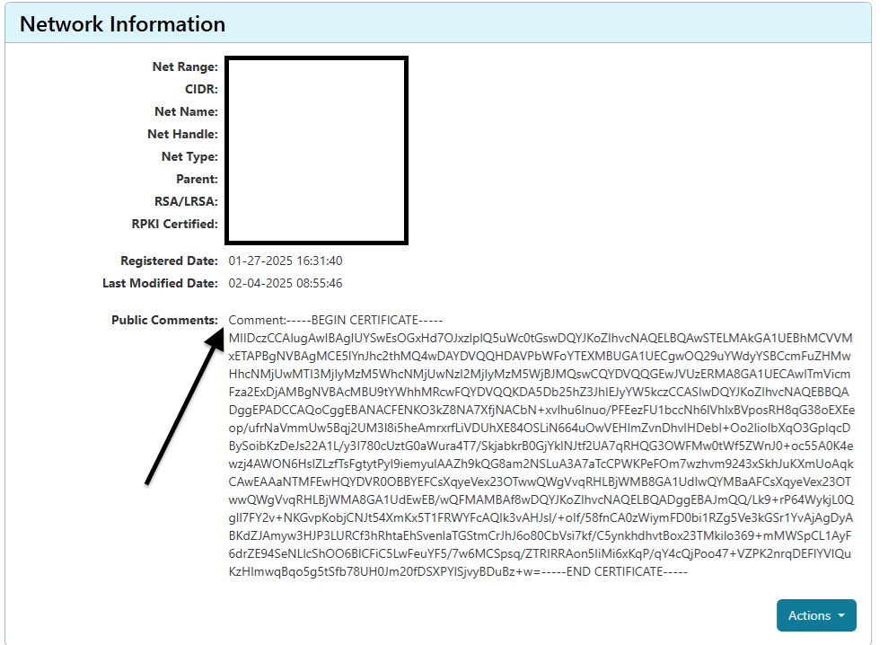
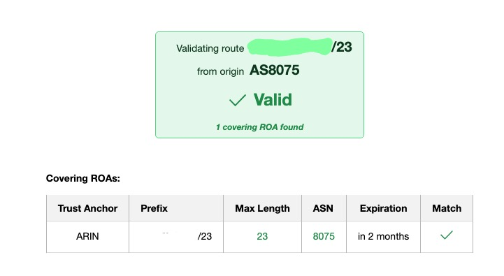
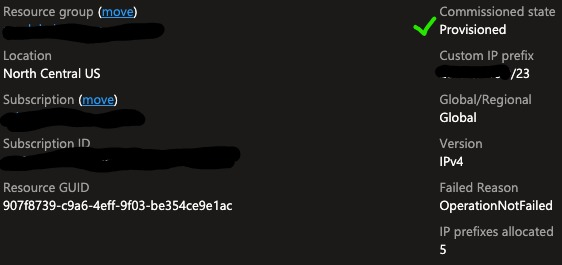
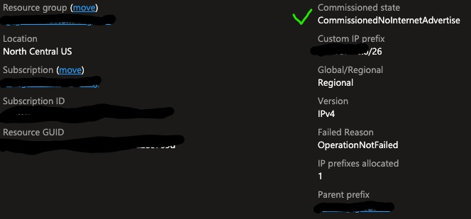
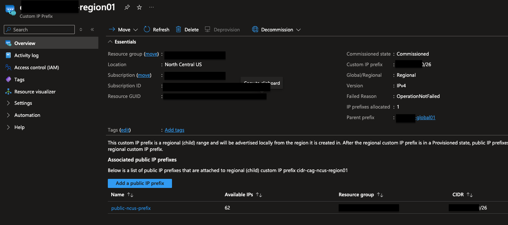
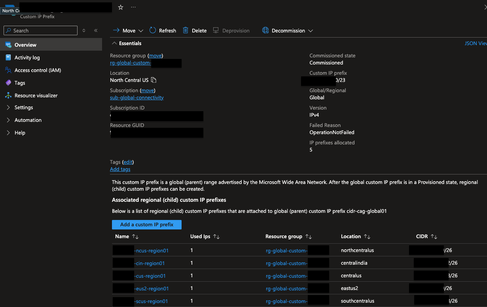

## Importing IPs into Azure

If you're just interested in the Microsoft guide, that can be found [here](https://learn.microsoft.com/en-us/azure/virtual-network/ip-services/custom-ip-address-prefix).

The docs (as of February 2025) appears straight forward, but there are quite a few gotchas and inconsistencies between the different providers. This guide is specifically catered towards, [ARIN](https://www.arin.net/).  Most of my experience is operating Azure through Terraform, so I've included snippets of TF code and a reference to a multi-region deployment we've used internally.

### How it Works

Microsoft can advertise any personal or organization owned IPv4 or IPv6 CIDR prefixes from their global ASN of `8075`.  This is accomplished by creating a [ROA (Route Origin Authorization)](https://www.arin.net/resources/manage/rpki/roa_request/).  Basically, this is a fancy way to presenting a public key for Azure to go find, and decrypt a string (wan validation) to create & advertise a block of IPs.

### Custom IP Prefixes vs. Public IP Prefixes

After you've gotten your custom IP Prefix provisioned, you've got to get them into a state for actual IP creation/usage.  The Custom Prefix resource cannot create IPs. It must have another *child* resource type associated called a `PublicIPPrefix`.

Both of these resources are A contiguous range of IP addresses, however, Microsoft forces the creation of the standardized public ip prefix for actual provisioning of IPs for the following reasons:

1. Simplified Management
2. Consistency & Predictabiliyt
3. Integration with Azure Services (the real reason)
4. Security & Compliance
5. Scalability

TL;DR - Microsoft's services are built around utilization of "Public IP Address/Public IP Prefix" resource types.  Its easier to add an extra creation step mapping Custom IP Prefixes to Public IP Prefixes than re-write their services to support both resource type.

#### Validation

Generate a self-signed certificate do sign your wan validation message needed later.

```Bash
openssl genrsa -out byoipprivate.key 2048
openssl req -new -x509 -key byoipprivate.key -days 180 | tr -d "\n" > byoippublickey.cer
```

Generate a ROA in your provider, (i.e. ARIN). Each provider has a unique process, so please refer to the docs [here](https://learn.microsoft.com/en-us/azure/virtual-network/ip-services/create-custom-ip-address-prefix-portal?tabs=azureportal%2Cpowershell%2Cunified#pre-provisioning-steps). In short, the public comment section needs to include the public key dataset **ONLY**.  This is the public key from above in `byoippublickey.cer`.  You can cat that file to get the necessary data.

```Bash
cat byoippublickey.cer
```

The examples in Microsoft's docs have extra data including the word "comment:", which is not required, and will break the validation process (at least for ARIN).


Additionally, Microsoft is vauge in the wording on the signing message value.  From their [docs](https://learn.microsoft.com/en-us/azure/virtual-network/ip-services/create-custom-ip-address-prefix-portal?tabs=azureportal%2Cconsole%2Cunified#certificate-readiness), we found their was abiguity in what dates were needed and where. This is due to ARIN using a slightly different term for validity data vs. expiry date (ARIN utilizes the term renewal date).

Use the following Bash to ensure you get the format. (Full disclosure, we were bad at reading, and the date-format caused us tons of headaches). 
Subscription ID where the Custom Prefix will be, the Internet routable CIDR block (/24 - /21 in size)

```Bash
byoipauth="00000000-0000-0000-0000-000000000|1.2.3.0/24|YYYYMMDD"
byoipauthsigned=$(echo $byoipauth | tr -d "\n" | openssl dgst -sha256 -sign byoipprivate.key -keyform PEM | openssl base64 | tr -d "\n")

byoipauthsigned

# Output
ABCDEFG0a1b2c0a1b2c0a1b2c0ca1b2c0a1b2c0a10a/1234567a/ABCDEFG0a1b2c0//ABCDEFG0a1b2c0a1b2c0a1b2c0ca1b2c0a1b2c0a10aABCDEFG0a1b2c0a1b2c0a1b2c0ca1b2c0a1b2c0a10aABCDEFG0a1b2c0a1b2c0a1b2c0ca1b2c0a1b2c0a10aABCDEFG0a1b2c0a1b2c0a1b2c0ca1b2c0a1b2c0a10aABCDEFG0a1b2c0a1b2c0a1b2c0ca1b2c0/ABCDEFG0a1b2c0a1b2c0a1b21212121212/ABCDEFG0a1b2c0a1b2c0a1b2c0ca1b2c0a1b2c0a10a==
```

The Output is the string value needed for the wan validation input into deployment. 


After the ROA exists, a wan validation message must be generated, along with a decision point by you, the admin on how you want to utilize this Custom Prefix in Azure.

1. **Global/Regional**: This is a *parent/child* relationship, where Azure's global WAN advertises the /23 and each region adverts their respective /26 (or any combination of parent CIDR/child CIDR).
2. **Unified**
    The global Azure WAN advertises everything as does each region.

My example is a Global/Regional one.  As an organization we allocated a /23 network to Azure, and we break that down regionally into /26. We can support up to 8 regions with this design.  It also allows us easily identify if/when a particular region adds a new public endpoint, and SecOps to have easily targeted scanning of our edge (/23).


Assuming you've followed the ARIN instructions correctly, you should see something like this:

I utilize this [free cloudflare tool](https://rpki.cloudflare.com/?view=validator) for validation

After you get throught this portion, there is still commissioning of said IPs in order for Azure to actually Advertise them.

For provisioning you can use all the normal methods, the only things to keep in mind are to ensure you have the proper `-IsParent` or `-CustomPrefixParent` flags appropriately set.

Parent CIDR (Global)
```PowerShell
$prefix =@{
    Name = 'myCustomGlobalPrefix'
    ResourceGroupName = 'myResourceGroup'
    Location = 'WestUS2'
    CIDR = '1.2.3.0/24'
    AuthorizationMessage = 'xxxxxxxx-xxxx-xxxx-xxxx-xxxxxxxxxxxx|1.2.3.0/24|YYYYMMDD'
    SignedMessage = $byoipauthsigned
}
$myCustomIPGlobalPrefix = New-AzCustomIPPrefix @prefix -IsParent
```

And Child (Regional)
```PowerShell
$prefix =@{
    Name = 'myCustomIPRegionalPrefix1'
    ResourceGroupName = 'myResourceGroup'
    Location = 'WestUS2'
    CIDR = '1.2.3.0/25'
}
$myCustomIPRegionalPrefix = New-AzCustomIPPrefix @prefix -CustomIpPrefixParent $myCustomIPGlobalPrefix -Zone 1,2,3
```

This is also fully managable in Terraform. I've linked a full project below, but here are the Terraform snippets for each resource type:
```Ruby
resource "azurerm_resource_group" "rg_for_cidr_prefix" {
  name     = "rg-global-custom-cidr"
  location = "North Central US"

  tags = {}
}

resource "azurerm_custom_ip_prefix" "cdir_global" {
  name                = "cidr-global01"
  location            = azurerm_resource_group.rg_for_cidr_prefix.location
  resource_group_name = azurerm_resource_group.rg_for_cidr_prefix.name

  commissioning_enabled         = false
  internet_advertising_disabled = false

  cidr                          = "1.2.3.4/23"
  roa_validity_end_date         = "YYYY-MM-DD"
  wan_validation_signed_message = "<signed_string_here>"

  tags = {}
}

resource "azurerm_custom_ip_prefix" "ncus_regional" {
  name                          = "cidr-ncus-region01"
  location                      = "Central US" #You must override the parent location to ensure the regional CIDRs end up in the right location
  resource_group_name           = azurerm_resource_group.rg_for_cidr_prefix.name
  parent_custom_ip_prefix_id    = azurerm_custom_ip_prefix.cdir_global.id
  commissioning_enabled         = true
  internet_advertising_disabled = true #this is a weird flag, that needs explanation.
  cidr                          = "1.2.3.4/26"
  zones = ["1", "2", "3"]

  tags = {}
}
```

### Full Terraform Example

I've provided santized terraform code to manage this entire process (my example has 5 regions).  This makes assumptions all the pre-req work is completed and then it provisions.

[GitHub Example](https://github.com/cleif/azure-terraform-examples/tree/main/azure-custom-cidrs)

### Commissioning IPs

When we provision the IPs, they aren't actually routable, they must be commissioned as well.  This is for both the regional and global instances.

Microsoft suggests the following pattern for Custom IP Prefixes

1. Provision all required regional custom IP prefixes in their respective regions. Create public IP prefixes and public IP addresses and attach to resources.
2. Commission each regional custom IP prefix and test connectivity to the IPs within the region. Repeat for each regional custom IP prefix.
3. Commission the global custom IP prefix, which advertises the larger range to the Internet. Complete this step only after verifying all regional custom IP prefixes (and derived prefixes/IPs) work as expected.

We additionally had to trigger manual `-Commission` flagged commands (seen below) in order to finally get Azure to start advertising these IPs correctly.  You may or may not need this.

```PowerShell
Update-AzCustomIpPrefix -Name <your-regional-cidr> -ResourceGroupName <your-regional-cidr-rg> -Commission

Update-AzCustomIpPrefix -Name <your-global-cidr> -ResourceGroupName <your-global-cidr-rg> -Commission
```

Global CIDR in a Provisioned state:

Regional CIDR in a Commissioned state, but Not Internet Advertised:

Regional CIDR in an Advertised state:

Global CIDR in an Advertised state:


### Using IPs

After Provisioning, you are able to create IP addresses from each regional public prefix.  Unless the IPs are advertised in both regional and global settings, these IPs will not be internet routable.

To create an IP from the public prefix:

```Ruby
resource "azurerm_public_ip_prefix" "cus_public_prefix" {
  name                = "public-ncus-prefix"
  location            = azurerm_custom_ip_prefix.cus_regional.location
  resource_group_name = azurerm_resource_group.rg_for_cidr_prefix.name
  zones               = ["1", "2", "3"] 

  prefix_length = 26

  tags = {}

}

resource "azurerm_public_ip" "pip_for_np_apim" {
  name                = "pip-np-ncus-apim"
  resource_group_name = azurerm_resource_group.rg_for_np_apim.name
  location            = azurerm_resource_group.rg_for_np_apim.location
  sku                 = "Standard"
  allocation_method   = "Static"
  public_ip_prefix_id = data.azurerm_public_ip_prefix.cus_public_prefix.id

  domain_name_label = "apim-np"

  tags = {}

}
```

Note, via terraform, there does not appear to be a way to specifiy a particular IP out of the CIDR, instead, Microsoft, just allocates the next available IP in the block (i.e. You can get 1.2.3.0/32) if its the first IP in the list.

Once this IP resource is created, it can be consumed by any service which supports Public IP Addresses (my example was for an APIM deployment).

#### Additional Notes

There was quite a few hoops, we internally needed to get through, that not everyone will encounter. I've left most of that out of this post.  Just be sure you all your legal paperwork with whatever Registar you use is in order to not deal with any failures relating to "ownership" concerns.